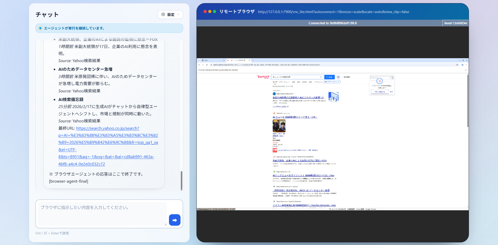

> 一番下に日本語版もあります

# Browser-Agent

<p align="center">
  
  
  
  
  
  
  
  
</p>

<p align="center">
  
</p>

## UI Preview

<p align="center">
  
</p>

## 🎬 Demo Videos
Click a thumbnail to open the video on YouTube.

| [](https://youtu.be/qXbq_8NWp1Y) | [](https://youtu.be/EaJG-JRtuKs) |
| --- | --- |
| Agent searches AI-related news | Agent finds the lowest AirPods price on Amazon |

A browser automation agent with a FastAPI web interface powered by modern LLMs. Control a real browser with natural language, watch it in real time, and run benchmarks like WebArena.

## 🚀 Overview

Browser-Agent combines the `browser_use` library with a FastAPI backend to provide:
- **Natural language control** of browser tasks.
- **Real-time visualization** via noVNC and live logs.
- **Multi-LLM support** (Gemini, OpenAI, Anthropic, DeepSeek, and more).
- **WebArena benchmarking** tools built in.

## ✨ Key Features

- **Web interface** for chat, browser view, and logs.
- **Live streaming** with SSE and VNC.
- **Scratchpad** for structured task notes (prices, names, reviews, etc.).
- **Docker-first** setup with Docker Compose.
- **Extensible architecture** separating core agent, API services, and UI.

## 🛠️ Quick Start (Docker Compose only)

### Prerequisites
- **Docker** and **Docker Compose**

### 1. Clone the repository
```bash
git clone https://github.com/kota-kawa/Browser-Agent.git
cd browser-agent
```

### 2. Configure environment variables
Copy the example secrets file and add your LLM API keys.
```bash
cp secrets.env.example secrets.env
```
Edit `secrets.env` and set keys such as `GOOGLE_API_KEY` or `OPENAI_API_KEY`.

### 3. Start the stack
```bash
docker network create multi_agent_platform_net
docker compose up --build
```

### 4. Open the UI
Visit **http://localhost:5005** in your browser.

## 📖 Usage

### Web UI
1. Open http://localhost:5005.
2. Enter a task in the chat box (e.g., “Find a good mechanical keyboard on amazon.com”).
3. Watch the browser on the left and logs/chat on the right.

### WebArena
Use the **WebArena** tab in the UI or call the API endpoints below.

### API Endpoints
- `POST /api/chat`: Send a task to the agent.
- `GET /api/stream`: Subscribe to the event stream.
- `POST /webarena/run`: Run a specific WebArena task.

## 📂 Project Structure

```
/
├── browser_use/       # Core agent logic, DOM manipulation, tools
├── flask_app/         # FastAPI web server, API routes, UI templates
│   ├── core/          # Config and environment setup
│   ├── services/      # Business logic (Agent Controller, History)
│   ├── routes/        # API endpoints
│   └── templates/     # HTML frontend
├── docker-compose.yml # Container orchestration
└── secrets.env        # API keys and configuration
```

## 📄 License

See [LICENSE.md](LICENSE.md) for details.

<details>
<summary>日本語</summary>

# Browser-Agent

<p align="center">
  
  
  
  
  
  
  
  
</p>

## UIプレビュー

<p align="center">
  
</p>

## 🎬 デモ動画
サムネイルをクリックすると、YouTubeで動画が再生されます。

| [](https://youtu.be/qXbq_8NWp1Y) | [](https://youtu.be/EaJG-JRtuKs) |
| --- | --- |
| エージェントがAI関連ニュースを検索する様子 | エージェントがAmazonでAirPodsの最安値を調べる様子 |

最新のLLMを活用したFastAPIベースのブラウザ自動化エージェントです。自然言語でブラウザを操作でき、実行状況をリアルタイムで可視化し、WebArenaのようなベンチマークも実行できます。

## 🚀 概要

`Browser-Agent` は `browser_use` ライブラリとFastAPIバックエンドを統合し、次の機能を提供します。
- **自然言語操作**: 指示に沿ってブラウザ作業を自動化します。
- **リアルタイム可視化**: noVNCとログで実行内容を確認できます。
- **マルチLLM対応**: Gemini、OpenAI、Anthropic、DeepSeek など。
- **WebArenaベンチマーク**: 標準タスクの実行・評価が可能です。

## ✨ 主な機能

- **Webインターフェース**: チャット、ブラウザ画面、ログを一画面で確認。
- **ライブストリーミング**: SSEとVNCによるリアルタイム表示。
- **Scratchpad**: 価格・名前・レビューなどの構造化メモ。
- **Docker Compose前提**のシンプル運用。
- **拡張可能な構成**: コアエージェント、API、UIを分離。

## 🛠️ クイックスタート（Docker Composeのみ）

### 前提条件
- **Docker** と **Docker Compose**

### 1. リポジトリをクローン
```bash
git clone https://github.com/kota-kawa/Browser-Agent.git
cd browser-agent
```

### 2. 環境変数の設定
サンプルをコピーしてAPIキーを設定します。
```bash
cp secrets.env.example secrets.env
```
`secrets.env` を編集し、`GOOGLE_API_KEY` や `OPENAI_API_KEY` を設定してください。

### 3. 起動
```bash
docker network create multi_agent_platform_net
docker compose up --build
```

### 4. UIを開く
**http://localhost:5005** にアクセスします。

## 📖 使い方

### Web UI
1. http://localhost:5005 を開きます。
2. チャットに指示を入力します（例: "amazon.comで良いメカニカルキーボードを探して"）。
3. 左にブラウザ画面、右にログとチャットが表示されます。

### WebArena
UIの **WebArena** タブ、またはAPIから実行できます。

### API エンドポイント
- `POST /api/chat`: エージェントにタスクを送信します。
- `GET /api/stream`: イベントストリームを購読します。
- `POST /webarena/run`: WebArenaの特定タスクを実行します。

## 📂 プロジェクト構成

```
/
├── browser_use/       # コアエージェントロジック、DOM操作、ツール
├── flask_app/         # FastAPI Webサーバー、APIルート、UIテンプレート
│   ├── core/          # 設定と環境構築
│   ├── services/      # ビジネスロジック（Agent Controller, History）
│   ├── routes/        # APIエンドポイント
│   └── templates/     # HTMLフロントエンド
├── docker-compose.yml # コンテナオーケストレーション
└── secrets.env        # APIキーと設定
```

## 📄 ライセンス

詳細は [LICENSE.md](LICENSE.md) を参照してください。

</details>
