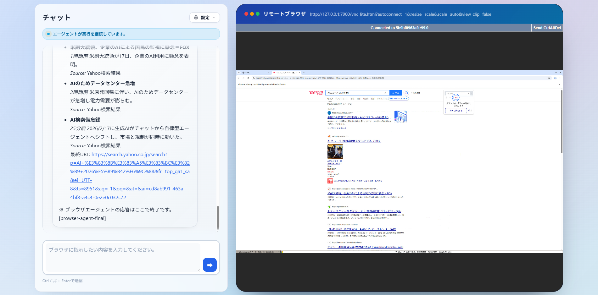
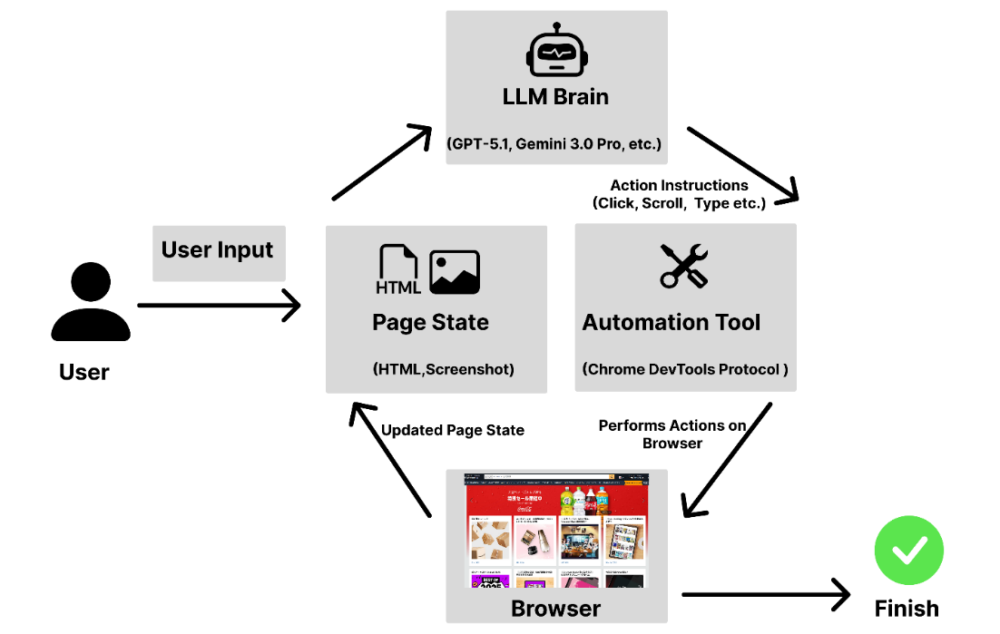
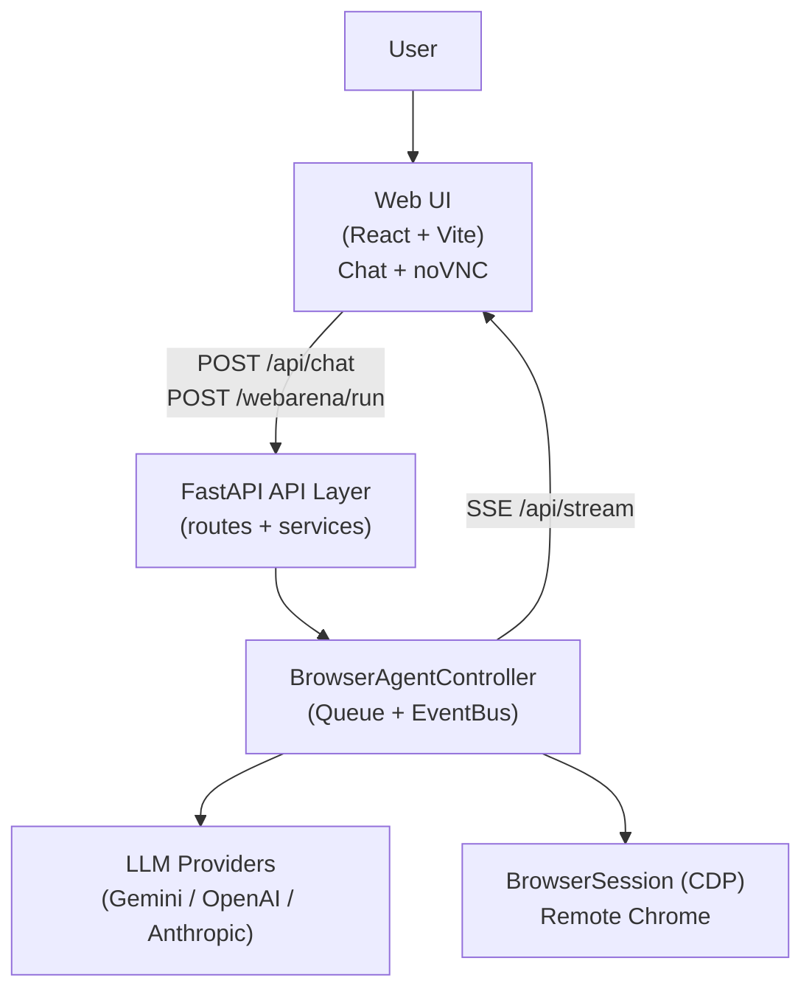
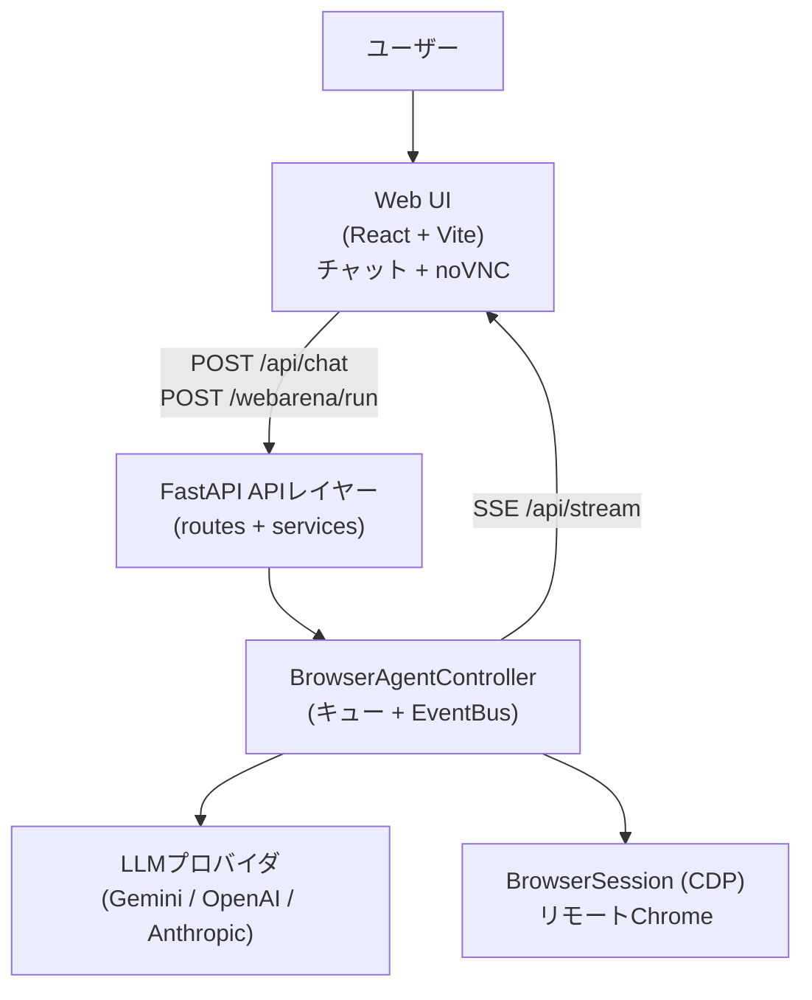

> 一番下に日本語版もあります

# Browser-Agent

<p align="center">
  
  
  
  
  
  
  
  
</p>

<p align="center">
  
</p>

## UI Preview

<p align="center">
  
</p>

## 🎬 Demo Videos

Click a thumbnail to open the video on YouTube.

<table>
<tr>
<td align="center">
<a href="https://youtu.be/qXbq_8NWp1Y"></a>
<br/><b>Agent searches AI-related news</b>
</td>
<td align="center">
<a href="https://youtu.be/EaJG-JRtuKs"></a>
<br/><b>Agent finds lowest AirPods price on Amazon</b>
</td>
</tr>
</table>

A browser automation agent with a FastAPI web interface powered by modern LLMs. Control a real browser with natural language, watch it in real time, and run benchmarks like WebArena.

**Motivation:** Most LLM-driven browser agents run as fully autonomous loops—when they fail, they fail silently and are hard to recover. Browser-Agent is built around the principle that humans should be able to step in at any point: pausing, redirecting, or resuming the agent mid-task. The goal is high-performance web automation that keeps a human in the loop exactly when it matters.

## 🚀 Overview

Browser-Agent combines the `browser_use` library with a FastAPI backend to provide:
- **Natural language control** of browser tasks via a web chat interface.
- **Real-time visualization** via noVNC, SSE, and live logs.
- **Multi-LLM support** (Gemini, OpenAI, Anthropic, DeepSeek, and more).
- **WebArena benchmarking** tools built in.
- **Scratchpad** for structured task notes (prices, names, reviews, etc.).
- **Docker-first** setup with Docker Compose.
- **Extensible architecture** separating core agent, API services, and UI.

## 🏗️ Architecture

<p align="center">
  
</p>


```mermaid
flowchart TB
    user["User"] --> ui["Web UI<br/>(React + Vite)<br/>Chat + noVNC"]
    ui -->|"POST /api/chat<br/>POST /webarena/run"| api["FastAPI API Layer<br/>(routes + services)"]
    api --> controller["BrowserAgentController<br/>(Queue + EventBus)"]
    controller --> llm["LLM Providers<br/>(Gemini / OpenAI / Anthropic)"]
    controller --> browser["BrowserSession (CDP)<br/>Remote Chrome"]
    controller -->|"SSE /api/stream"| ui
```

## 🧠 Design Decisions

- **FastAPI over Flask**: Chosen for async-first request handling, native type-hint validation, and clean SSE endpoint implementation.
- **SSE over WebSockets**: Status updates are primarily server-to-client one-way streams; SSE reduced complexity while keeping real-time UX.
- **Long-lived controller/session**: `BrowserAgentController` keeps a warm browser session (`keep_alive`) to reduce repeated startup cost between tasks.
- **CDP-native browser control**: Direct CDP integration provides predictable browser introspection/control for `browser_use` workflows.
- **In-memory state over Redis (current scope)**: History/event broadcasting is intentionally in-process for low operational overhead in single-node deployments; Redis is a scale-out option when multi-instance coordination becomes necessary.
- **Security-first defaults**: Rate limiting, admin token auth, and localhost-only CDP/VNC binding are enforced out of the box—preventing external browser takeover and API abuse without requiring explicit opt-in.

## 📊 WebArena Browser Agent Evaluation

These results were obtained by running the Browser-Agent on WebArena Shopping tasks (N=187).

| Model | Success / Total | Score |
| --- | --- | --- |
| GPT-5.1 | 61 / 187 | 32.6% |
| Qwen 32B | 43 / 187 | 23% |
| GPT-OSS 20B | 49 / 187 | 26% |

> **Reference baselines:** The original WebArena paper reports human-level performance at ~78%. Early rule-based agent baselines scored in the 10–15% range. These results reflect current GPT-class LLMs with no task-specific fine-tuning.

### Browser Agent

**Role**
The Browser Agent autonomously performs multi-step web tasks such as search, navigation, filtering, and form interaction.

**Evaluation Protocol**
I evaluated the Browser Agent on the **WebArena Shopping environment**, using three automatic criteria:
- URL match
- string match
- DOM state verification

**Failure Analysis**
The main bottlenecks were dynamic widgets, branching exploration, and visually structured UI interactions that are difficult to solve from DOM text alone.

**Why this matters**
Rather than hiding failures, I explicitly quantified them to identify where current LLM-based browser agents still break in realistic environments.

## 📂 Project Structure

```
/
├── browser_use/       # Core agent logic, DOM manipulation, tools
├── fastapi_app/         # FastAPI web server, API routes, UI templates
│   ├── core/          # Config and environment setup
│   ├── services/      # Business logic (Agent Controller, History)
│   ├── routes/        # API endpoints
│   └── frontend/      # React + Vite frontend
├── docker-compose.yml # Container orchestration
└── secrets.env        # API keys and configuration
```

## 🛠️ Quick Start (Docker Compose only)

### Prerequisites
- **Docker** and **Docker Compose**

### 1. Clone the repository
```bash
git clone https://github.com/kota-kawa/Browser-Agent.git
cd browser-agent
```

### 2. Configure environment variables
Copy the example secrets file and add your LLM API keys.
```bash
cp secrets.env.example secrets.env
```
Edit `secrets.env` and set keys such as `GOOGLE_API_KEY` or `OPENAI_API_KEY`. See `secrets.env.example` for all available options including rate limits, timeouts, LLM budget caps, and admin token configuration.

### 3. Start the stack
```bash
docker network create multi_agent_platform_net
docker compose up --build
```
Note: browser debug ports are bound to localhost only (`127.0.0.1:4444`, `127.0.0.1:7900`) to prevent external CDP/VNC takeover.

### 4. Open the UI
Visit **http://localhost:5005** in your browser.

## 📖 Usage

### Web UI
1. Open http://localhost:5005.
2. Enter a task in the chat box (e.g., “Find a good mechanical keyboard on amazon.com”).
3. Watch the browser on the left and logs/chat on the right.

### WebArena
Use the **WebArena** tab in the UI or call the API endpoints below.

### API Endpoints
- `POST /api/chat`: Send a task to the agent.
- `GET /api/stream`: Subscribe to the event stream.
- `POST /webarena/run`: Run a specific WebArena task.
- Admin-only endpoints require `X-Admin-Token: <ADMIN_API_TOKEN>` (or `Authorization: Bearer <ADMIN_API_TOKEN>`).

## ✅ Testing

### Backend (Python / FastAPI)
Run all backend unit tests with `pytest`:

```bash
pytest
```

### Frontend (React / TypeScript)
Run frontend unit tests with Vitest:

```bash
cd fastapi_app/frontend
npm install
npm run test
```

CI note: these backend/frontend tests are also executed automatically on every push and pull request via GitHub Actions (`.github/workflows/ci-tests.yml`).

### CD (GitHub Actions)
The repository also includes a CI/CD workflow at `.github/workflows/ci-cd.yml`.

- Runs `ruff`, `pip-audit`, `pytest`, and `docker compose build` on push / pull request / manual dispatch.
- Deploys only on `push` to `main` after all checks pass.
- Deploys over SSH, then runs `./up.sh -d` on the server and verifies service health.
- Performs diagnostics + rollback to the previous commit if deployment fails.

## 📄 License

See [LICENSE.md](LICENSE.md) for details.

<details>
<summary>日本語</summary>

# Browser-Agent

<p align="center">
  
  
  
  
  
  
  
  
</p>

## UIプレビュー

<p align="center">
  
</p>

## 🎬 デモ動画

サムネイルをクリックすると、YouTubeで動画を開けます。

<table>
<tr>
<td align="center">
<a href="https://youtu.be/qXbq_8NWp1Y"></a>
<br/><b>エージェントがAI関連ニュースを検索する様子</b>
</td>
<td align="center">
<a href="https://youtu.be/EaJG-JRtuKs"></a>
<br/><b>エージェントがAmazonでAirPodsの最安値を調べる様子</b>
</td>
</tr>
</table>

最新のLLMを活用したFastAPIベースのブラウザ自動化エージェントです。自然言語でブラウザを操作でき、実行状況をリアルタイムで可視化し、WebArenaのようなベンチマークも実行できます。

**開発動機:** LLMベースのブラウザエージェントを完全自律で動かすと、失敗しても気づきにくくリカバリが難しいという問題があります。Browser-Agentは「人間が必要なときにいつでも介入できる」設計を軸に開発しました。タスクの途中で一時停止・指示の修正・再開が可能で、高いタスク性能と人間によるコントロールを両立することを目指しています。

## 🚀 概要

`Browser-Agent` は `browser_use` ライブラリとFastAPIバックエンドを統合し、次の機能を提供します。
- **自然言語操作**: チャットUIから指示を送るだけでブラウザ作業を自動化。
- **リアルタイム可視化**: noVNC・SSE・ライブログで実行内容を確認。
- **マルチLLM対応**: Gemini、OpenAI、Anthropic、DeepSeek など。
- **WebArenaベンチマーク**: 標準タスクの実行・評価が可能。
- **Scratchpad**: 価格・名前・レビューなどの構造化メモ機能。
- **Docker Compose前提**のシンプル運用。
- **拡張可能な構成**: コアエージェント、API、UIを分離。

## 🏗️ アーキテクチャ図

<p align="center">
  
</p>


```mermaid
flowchart TB
    user_ja["ユーザー"] --> ui_ja["Web UI<br/>(React + Vite)<br/>チャット + noVNC"]
    ui_ja -->|"POST /api/chat<br/>POST /webarena/run"| api_ja["FastAPI APIレイヤー<br/>(routes + services)"]
    api_ja --> controller_ja["BrowserAgentController<br/>(キュー + EventBus)"]
    controller_ja --> llm_ja["LLMプロバイダ<br/>(Gemini / OpenAI / Anthropic)"]
    controller_ja --> browser_ja["BrowserSession (CDP)<br/>リモートChrome"]
    controller_ja -->|"SSE /api/stream"| ui_ja
```

## 🧠 技術的な意思決定 (Design Decisions)

- **FastAPIをFlaskより優先**: 非同期処理を前提にしやすく、型ヒントによる検証とSSE実装がシンプルになるため。
- **WebSocketではなくSSE**: 本プロジェクトの進捗配信は主にサーバー→クライアントの一方向ストリームで十分で、構成の複雑さを抑えられるため。
- **長寿命のコントローラー/セッション**: `BrowserAgentController` でブラウザセッションをウォーム状態 (`keep_alive`) に保ち、タスク間の起動コストを下げるため。
- **CDPネイティブ制御**: `browser_use` のワークフローで必要なブラウザ状態取得・操作を安定して行えるため。
- **Redisではなくインメモリ状態管理（現スコープ）**: 単一ノード運用では依存を減らして運用コストを下げることを優先。将来のマルチインスタンス化ではRedis連携を拡張候補として想定。
- **セキュリティのデフォルト有効化**: IPレート制限・管理者トークン認証・CDPとVNCのlocalhostバインドを設定なしで適用。外部からのブラウザ乗っ取りや不正なAPI呼び出しを防止する。

## 📊 WebArenaでのBrowserエージェント評価

この結果は、WebArenaのShoppingタスクでBrowser-Agentを実行したものです（N=187）。

| モデル | 成功数 / 総数 | スコア |
| --- | --- | --- |
| GPT-5.1 | 61 / 187 | 32.6% |
| Qwen 32B | 43 / 187 | 23% |
| GPT-OSS 20B | 49 / 187 | 26% |

> **参考ベースライン:** WebArena論文における人間のスコアは約78%。初期のルールベースエージェントは10〜15%程度。これらの結果はタスク固有のファインチューニングなしのGPTクラスモデルによるものです。

### Browser Agent

**役割**
Browser Agentは、検索・ナビゲーション・フィルタリング・フォーム操作などのマルチステップWebタスクを自律的に実行します。

**評価プロトコル**
**WebArena Shoppingenv** で3種類の自動評価基準を用いてBrowser Agentを評価しました。
- URLマッチ
- 文字列マッチ
- DOM状態検証

**失敗分析**
主なボトルネックは、動的ウィジェット、分岐探索、およびDOMテキストだけでは解決が難しい視覚的に構造化されたUIインタラクションでした。

**なぜこれが重要か**
失敗を隠すのではなく、現在のLLMベースのブラウザエージェントが現実的な環境でどこで壊れるかを特定するために、明示的に数値化しました。

## 📂 プロジェクト構成

```
/
├── browser_use/       # コアエージェントロジック、DOM操作、ツール
├── fastapi_app/         # FastAPI Webサーバー、APIルート、UIテンプレート
│   ├── core/          # 設定と環境構築
│   ├── services/      # ビジネスロジック（Agent Controller, History）
│   ├── routes/        # APIエンドポイント
│   └── frontend/      # React + Vite フロントエンド
├── docker-compose.yml # コンテナオーケストレーション
└── secrets.env        # APIキーと設定
```

## 🛠️ クイックスタート（Docker Composeのみ）

### 前提条件
- **Docker** と **Docker Compose**

### 1. リポジトリをクローン
```bash
git clone https://github.com/kota-kawa/Browser-Agent.git
cd browser-agent
```

### 2. 環境変数の設定
サンプルをコピーしてAPIキーを設定します。
```bash
cp secrets.env.example secrets.env
```
`secrets.env` を編集し、`GOOGLE_API_KEY` や `OPENAI_API_KEY` を設定してください。レート制限・タイムアウト・LLM予算上限・管理者トークンなど全設定項目は `secrets.env.example` を参照してください。

### 3. 起動
```bash
docker network create multi_agent_platform_net
docker compose up --build
```
補足: ブラウザのデバッグ用ポートは外部公開せず、localhost のみにバインドされています（`127.0.0.1:4444`, `127.0.0.1:7900`）。

### 4. UIを開く
**http://localhost:5005** にアクセスします。

## 📖 使い方

### Web UI
1. http://localhost:5005 を開きます。
2. チャットに指示を入力します（例: "amazon.comで良いメカニカルキーボードを探して"）。
3. 左にブラウザ画面、右にログとチャットが表示されます。

### WebArena
UIの **WebArena** タブ、またはAPIから実行できます。

### API エンドポイント
- `POST /api/chat`: エージェントにタスクを送信します。
- `GET /api/stream`: イベントストリームを購読します。
- `POST /webarena/run`: WebArenaの特定タスクを実行します。
- 管理者向けエンドポイントは `X-Admin-Token: <ADMIN_API_TOKEN>`（または `Authorization: Bearer <ADMIN_API_TOKEN>`）が必要です。

## ✅ テスト実行

### バックエンド（Python / FastAPI）
`pytest` でバックエンドのユニットテストを実行します。

```bash
pytest
```

### フロントエンド（React / TypeScript）
Vitest でフロントエンドのユニットテストを実行します。

```bash
cd fastapi_app/frontend
npm install
npm run test
```

補足: これらのバックエンド/フロントエンドテストは、GitHub Actions（`.github/workflows/ci-tests.yml`）により push / pull request ごとに自動実行されます。

### CD（GitHub Actions）
このリポジトリには `.github/workflows/ci-cd.yml` の CI/CD ワークフローも含まれています。

- push / pull request / 手動実行で `ruff`、`pip-audit`、`pytest`、`docker compose build` を実行
- すべて成功した場合のみ、`main` ブランチへの push でデプロイ実行
- サーバーへ SSH 接続し、`./up.sh -d` で更新後にサービスヘルスを確認
- 失敗時は診断ログを出力し、直前コミットへロールバック

## 📄 ライセンス

詳細は [LICENSE.md](LICENSE.md) を参照してください。

</details>
